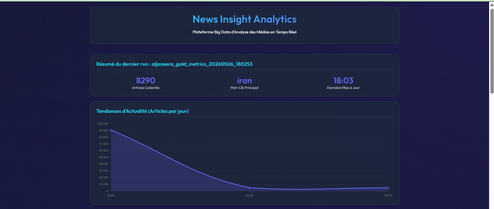
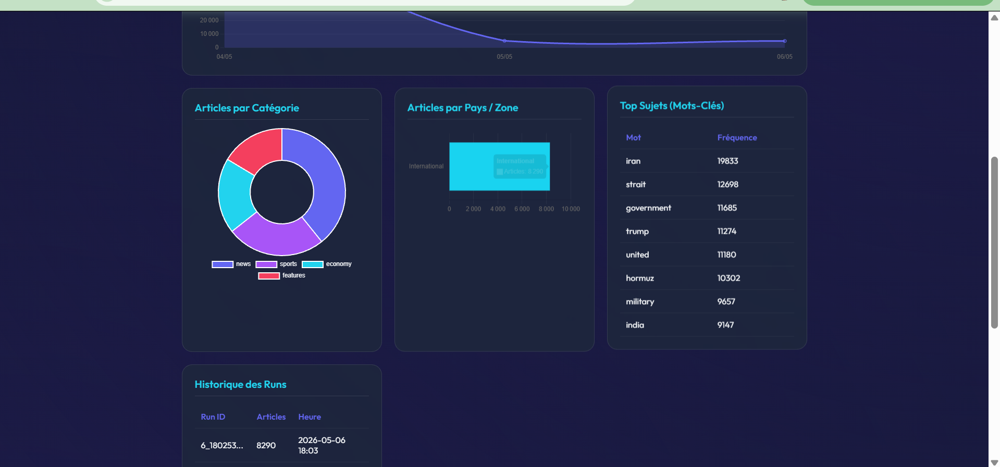
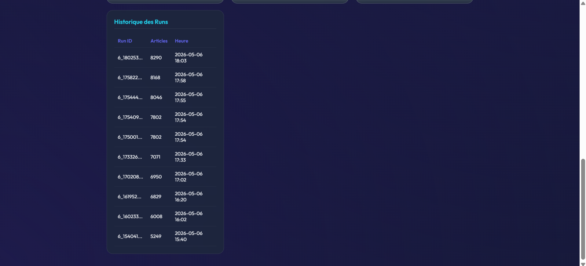

# Projet Scraping et Pipeline Big Data - EMSI Casablanca

## Contexte
Ce projet met en place une plateforme Big Data de collecte et d'analyse d'articles de presse en temps réel.
Réalisé dans le cadre de la filière **IADATA (2025/2026)**, il répond aux exigences d'ingestion hybride (batch/streaming), de stockage distribué (Data Lake), d'architecture médaillon, et de visualisation décisionnelle.

## Architecture de la Solution

- **Scraping** : Python + BeautifulSoup (multi-sections Al Jazeera).
- **Ingestion** :
  - **Batch** : Orchestration Airflow (toutes les heures).
  - **Streaming** : Kafka Producer envoyant les articles vers le topic `aljazeera-articles`.
- **Data Lake (MinIO)** : Stockage persistant des données sur trois couches (Bronze, Silver, Gold).
- **Architecture Médaillon** :
  - **Bronze** : Données brutes (JSON).
  - **Silver** : Nettoyage (suppression pub), normalisation, déduplication, détection de langue.
  - **Gold** : Agrégations analytiques (pays, catégories, tendances, keywords).
- **Data Warehouse** : PostgreSQL stockant les tables finales pour le dashboard.
- **Visualisation** : Dashboard Flask interactif avec graphiques **Chart.js**.

## Qualité et Gouvernance des données

### 1. Contrôles de Qualité (Data Quality)
- **Complétude** : Détection des articles sans titre ou sans date.
- **Validité** : Rejet des articles avec un contenu trop court (< 100 caractères).
- **Validation de Schéma** : Script `validate_schema.py` vérifiant la présence des 10 champs obligatoires avant le passage en Gold.

### 2. Gouvernance et Traçabilité
- **Traçabilité** : Chaque article possède un `run_id`, un `scraped_at` et un `cleaned_at`.
- **Nettoyage Avancé** : Filtrage automatique des zones publicitaires ("Advertisement", "Newsletter") dès la couche Silver.
- **Idempotence** : Le chargement dans le Warehouse utilise une stratégie `DELETE` + `INSERT` par `run_id`, garantissant l'absence de doublons même en cas de re-exécution.

## Aperçu Visuel (Dashboard)

Voici un aperçu de l'interface d'analyse en temps réel :


*Vue d'ensemble : Volume d'articles, mot-clé principal et dernières tendances.*


*Répartition par catégories (News, Sports, etc.) et par zones géographiques.*


*Détail des mots-clés les plus fréquents et historique des exécutions du pipeline.*

## Installation et Exécution

### 1. Lancement de l'infrastructure (Kafka, Airflow, MinIO, Postgres)
```powershell
cd "phase2"
docker compose up --build
```

### 2. Lancement du Scraper (Optionnel - Batch manuel)
```powershell
docker compose up scraper
```

## Services et Ports
| Service | URL / Port |
|---------|------------|
| Dashboard | http://localhost:8050 |
| Airflow Webserver | http://localhost:8081 |
| Kafka UI | http://localhost:8080 |
| MinIO Console | http://localhost:9001 |

---
**Date de rendu :** 10 Mai 2026.
**Filière :** IADATA - EMSI Casablanca.
